<html lang="ru">
<head>
    <meta charset="UTF-8">
    <meta name="viewport" content="width=device-width, initial-scale=1.0">
    <title>Ануфриев Дмитрий - Digital Art, композитор, diy, noise, художник Санкт-Петербург, Circuit bend</title>
    
    

    
</head>
<body>

    [ || ]
    [ >> ]

<!-- Добавь onended="nextTrack()" внутрь тега: -->
<audio id="bg-music" data-current="1" onended="nextTrack()"></audio>

 этот сайт представляет собой самодостаточный арт-объект Нажмите на правую картинку чтобы получить полный экспириенс в верхней части сайта находятся кнопки управления звуком в Нижней - кругом  
    

    
        

             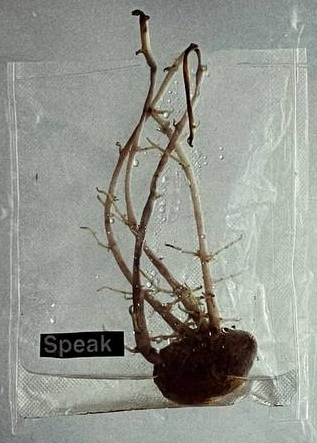 Я ЛЮБЛЮ ПОКОЙ
        

        

             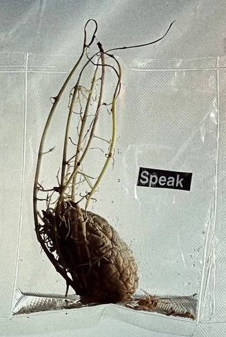 ШУМ / ВХОД
        

    

    █║▌│█│║▌║││█║▌ ANUFRIEV_DMITRY V.2.0.2.6

    [SYSTEM_STABLE] ___/‾‾\___ ALVA_NOTO_MODE

░▒▓█ ERROR_01010101_SYSTEM_FAILURE_RECOVERY_░▒▓█

██████████ DATA_STREAM_ANUFRIEV_██████████

[ +++ ] ЭЛЕКТРОХОЛМ [ +++ ] ALVA_NOTO_MODE  [ +++ ] ELECTROXOLM

<header><h1>АНУФРИЕВ ДМИТРИЙ</h1>  композитор и художник из санкт-петербурга, работающий в смешанной технике. инсталляции, звуковые diy-объекты, работы в вакуумных пакетах, circuit bend, 2d и 3d сканирование</header>

    <a href="gallery.html" class="glitch-button">Галерея</a>
    <a href="manifest.html" class="glitch-button">Обо мне</a>
    <a href="contact.html" class="glitch-button">Контакты</a>

    

        <label>size</label>
        <input type="range" id="sizeRange" min="20" max="900" value="200">
    

    

        <label>speed</label>
        <input type="range" id="speedRange" min="0" max="33" value="1">
    

<!-- Одиночное изображение во всю ширину -->

    

        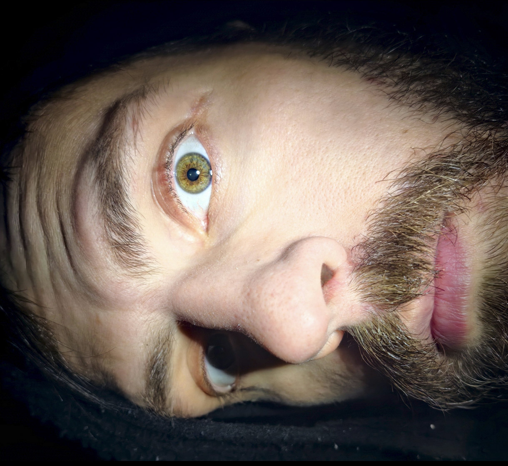
    

    <!-- КАРТИНКИ ТЕПЕРЬ ВСТАВЛЯЮТСЯ ТАК (ЧЕРЕЗ ТЕГ IMG), ЧТОБЫ КОЛОНКИ РАБОТАЛИ -->
    
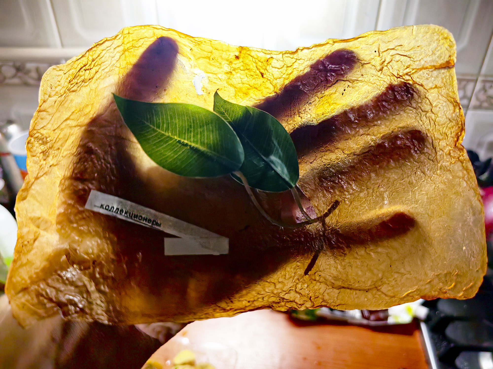

    
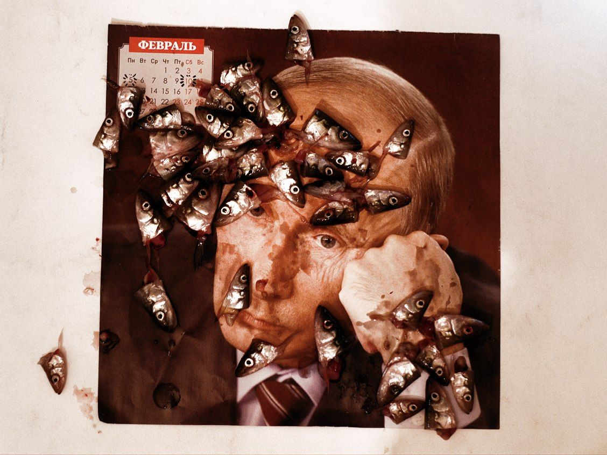

    
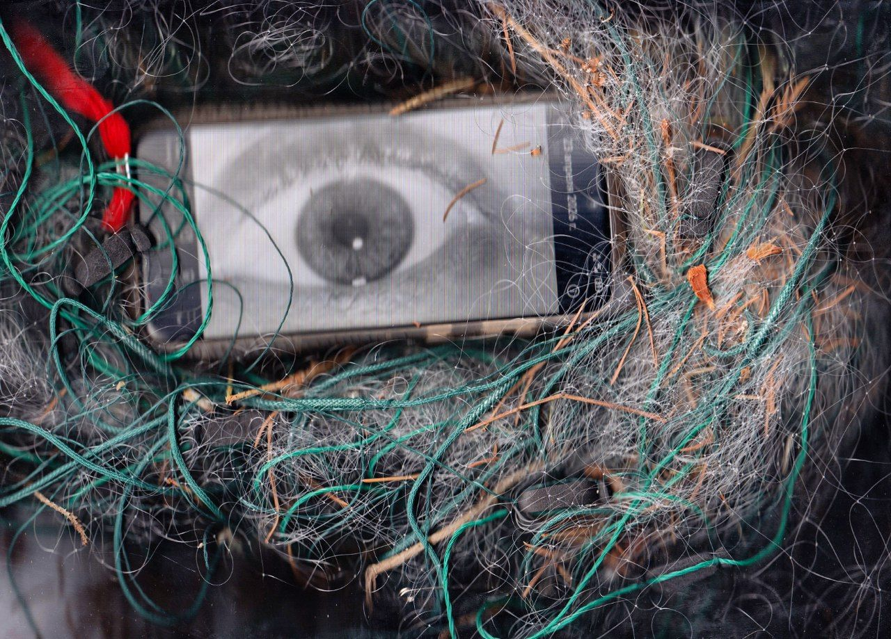

    

        <video loop muted autoplay playsinline><source data-src="vacuum.mp4" type="video/mp4"></video>
    

    
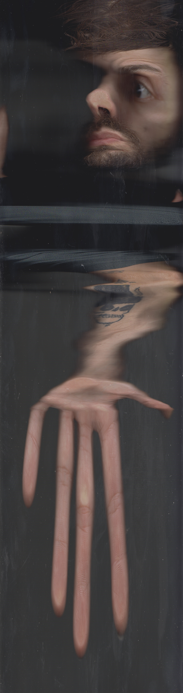

        <video loop muted autoplay playsinline><source data-src="2_5453932549736797835.mp4" type="video/mp4"></video>
    

        <video loop muted autoplay playsinline><source data-src="VID_20260502_072620_076.mp4" type="video/mp4"></video>
    

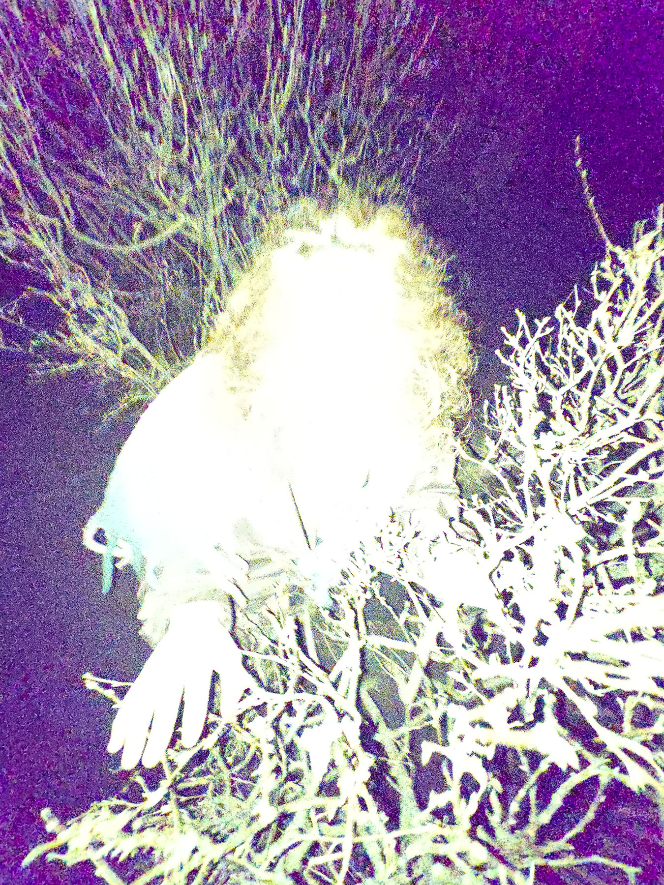

    
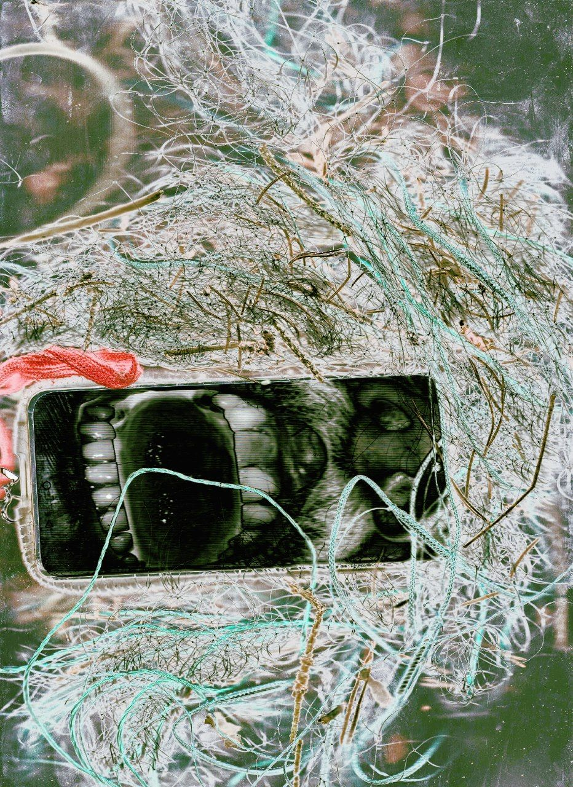

    

        <video loop muted autoplay playsinline><source data-src="VID_20260502_072915_864.mp4" type="video/mp4"></video>
    

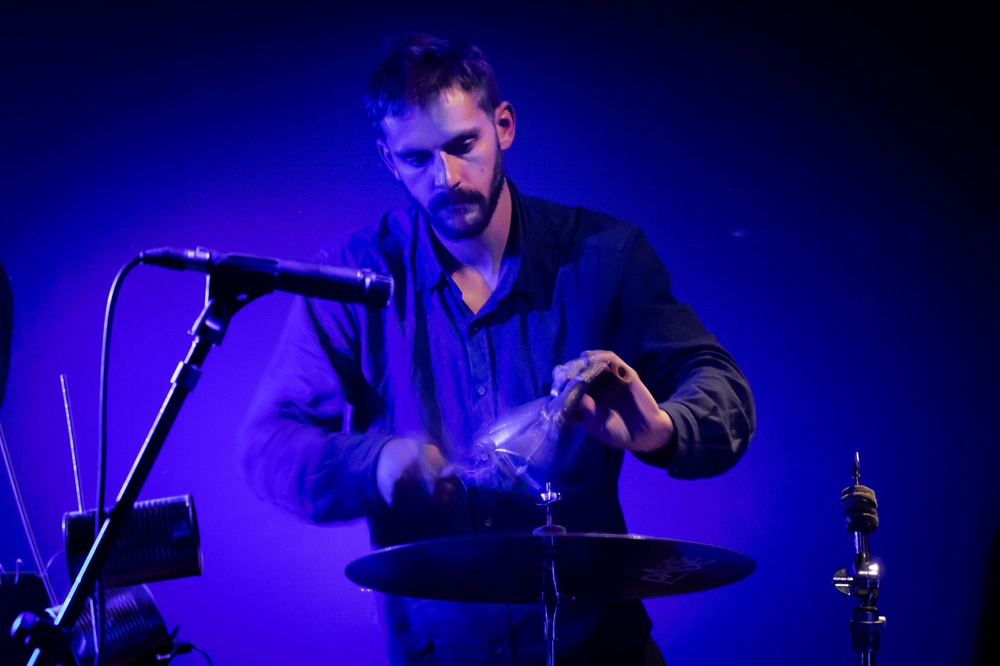

    
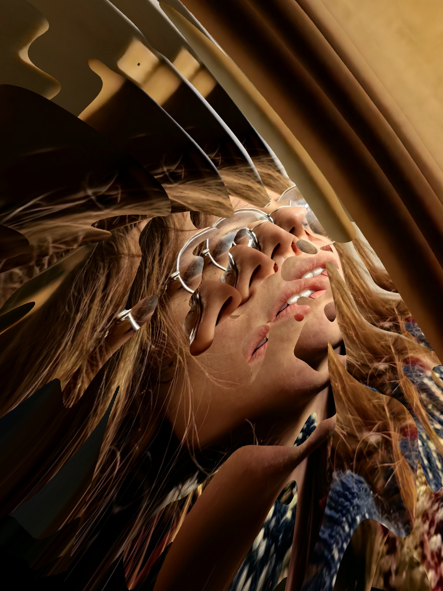

    
[ Здесь будет наш с вами проект если вы напишите мне, а пока здесь просто буквы ] 

  

        <video loop muted autoplay playsinline><source data-src="VID_20260502_072919_416.mp4" type="video/mp4"></video>
    

        <video loop muted autoplay playsinline><source data-src="VID_20260502_082928_229.mp4" type="video/mp4"></video>
    

галерея заканчивается здесь ..здесь .дальше начинается пустое пространство, как будто степь, бесконечное поле, усыпанное снегом.. Я бы хотел чтобы <h1>текст</h1> наслаивался и переходил в <h1>белое</h1>, я бы хотел чтобы каждый текст наслаивался и переходил в белое. так наслаивается <h1>человек</h1>.

    

        <!-- Тексты с разным смещением, чтобы они наслаивались друг на друга -->
        <h1 style="transform: translate(-5%, -40%);">человек</h1>
        <h1 style="transform: translate(40%, 15%); opacity: 0.7; font-size: 20vw;">наслаивается</h1>
        <h1 style="transform: translate(-2%, 20%); font-size: 70vw;">БЕЛОЕ</h1>
        <h1 style="transform: translate(15%, -5%); opacity: 0.4; font-size: 20vw;">человек</h1>
        <h1 style="transform: translate(-10%, 40%); filter: blur(5px);">СТЕПЬ</h1>
        <h1 style="transform: translate(0, 0); font-size: 90vw; opacity: 0.2;">ЧЕЛОВЕК</h1>
        <h1 style="transform: translate(-30%, 40%); font-size: 70vw;">Снег</h1>
    

    <h2 style="font-size: 11px; color: black; text-transform: uppercase; border-bottom: 1px solid black; display: inline-block;">ОСТАВИТЬ СЛЕД [GUESTBOOK]</h2>
    
    <!-- Форма -->
    

        <input type="text" id="guestName" placeholder="ИМЯ/Контакт" 
               style="background: transparent; color: black; border: 1px solid black; padding: 8px; font-family: monospace; font-size: 12px; font-weight: normal; outline: none;">
    

<!-- (Тег textarea для многострочного текста): -->
<textarea id="guestMsg" placeholder="Текст/ASCII рисунок" rows="6" style="background: transparent; color: black; border: 1px solid black; padding: 8px; font-family: 'Courier New', monospace; font-size: 13px; width: 60%; outline: none; resize: vertical; display: block; margin-top: 10px;"></textarea>

        
        <button onclick="sendSignal()" class="glitch-button" 
                style="background: transparent; color: black; border: 1px solid black; cursor: pointer; padding: 8px 15px; font-size: 10px;">ОТПРАВИТЬ</button>
    

    <!-- Сюда будет подгружаться текст -->
    

        ЗАГРУЗКА СООБЩЕНИЙ...
    

    

</body>
</html>
